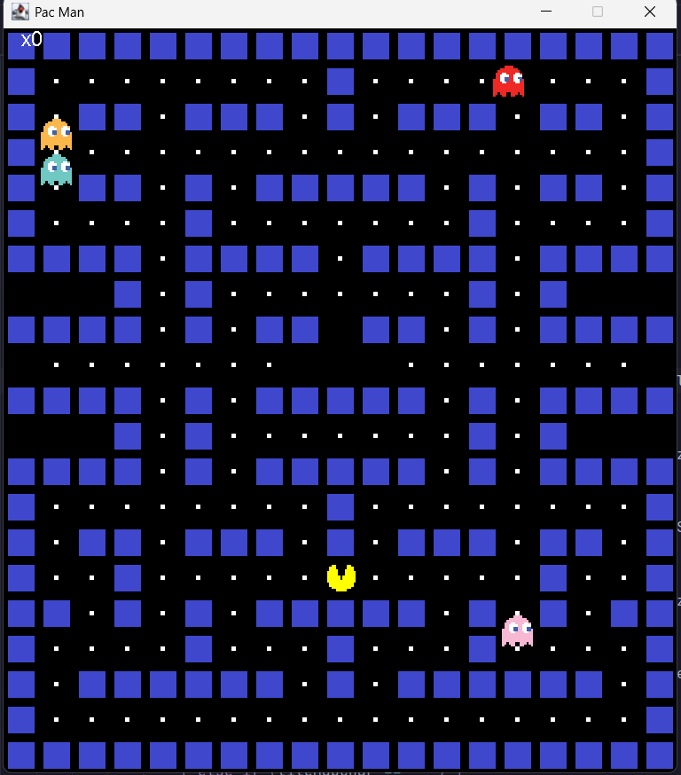

# PacMan Game

This project allowed me to learn how to create a game loop, create a jframe and jpanel, draw images on the jpanel, load the game map using a tilemap, add click handlers to make the pacman move, create a simple algorithm to move each ghost at random, detect collisions between the pacman and ghosts, have pacman eat the food pellets, add a running score, and reset the game when pacman collides with a ghost.

# How the game looks :) :

